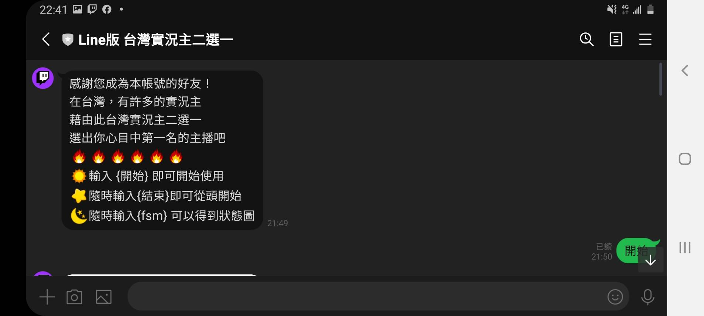
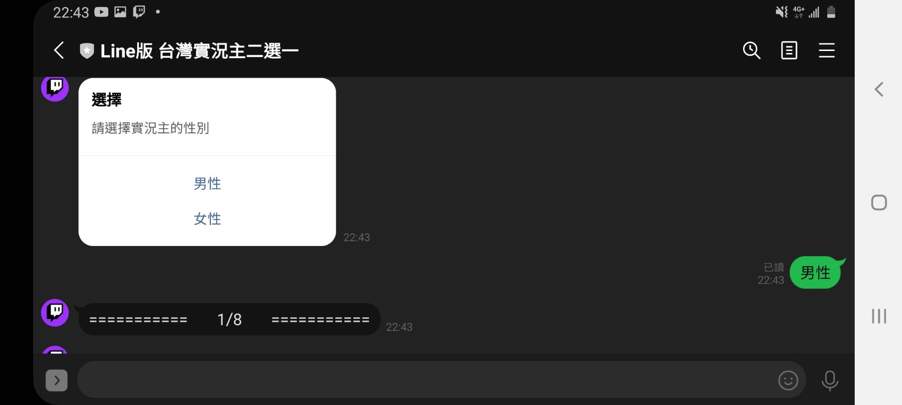
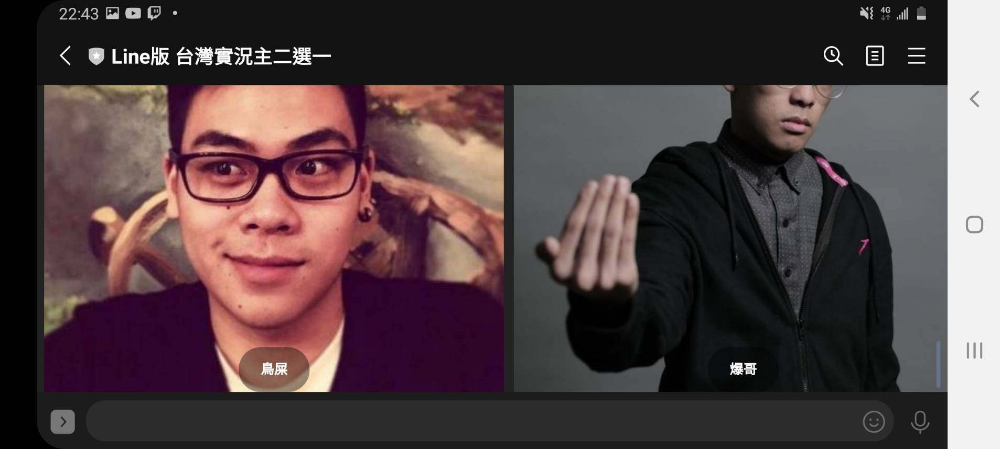
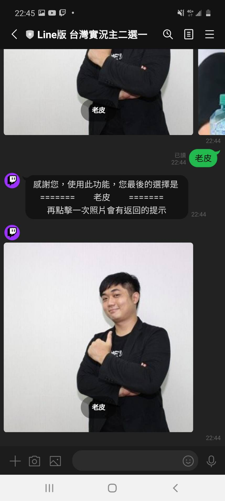
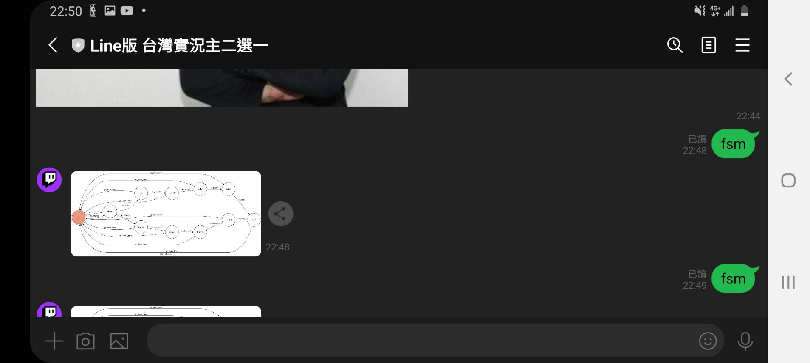
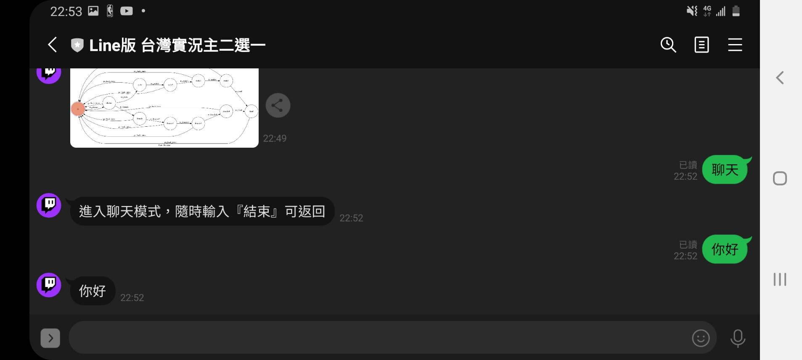
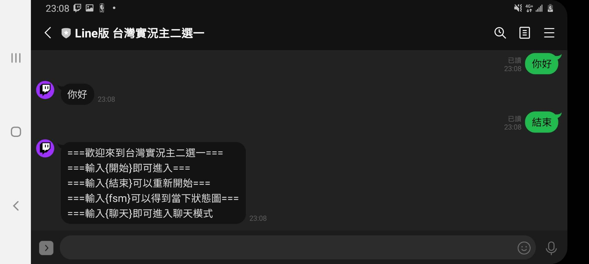
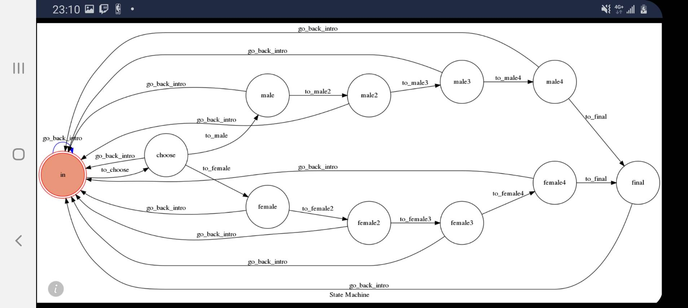

# Line版 台灣實況主二選一

[](https://codeclimate.com/github/NCKU-CCS/TOC-Project-2020/maintainability)

[](https://snyk.io/test/github/NCKU-CCS/TOC-Project-2020)


## 前言
近年來，實況的風氣在台灣越來越盛行，各大平台都爭相開始投入這塊，不管是Twitch、Youtube、Facebook、IG……等等，而今天這個實況主二選一的所有實況主都是台灣有名的實況主，主要是選自Twitch以及Facebook這兩大平台。藉由此功能來選出你心目中的第一名。

## 構想
使用Button、ImageCarouse、TextMessage實作功能，讓使用者可以直接點取自己喜歡的實況，以及簡單的使用語句，讓使用者可以方便的使用。

## 使用說明
首先，得先加好友


基本操作
* 輸入”開始 ”，即可開始二選一功能
* 輸入”聊天 ”，可以回覆與您輸入的相同字句
* 隨時可以輸入”結束 ”，回到最開始的狀態
* 進入二選一功能後，點選圖片選取你喜愛的實況主


## Prerequisite
* Python 3.6 以上
* HTTPS Server

## 使用範例








## Finite State Machine


## state 說明
* in : 使用者一開始的狀態，輸入”開始 ”開始使用
* choose : 選擇實況主的性別
* male: 進入男性實況主第一輪比較取8強
* male2: 進入男性實況主第二輪比較取4強
* male3: 進入男性實況主第三輪較取冠亞
* male4: 取男性實況主冠軍
* female: 進入女性實況主第一輪比較取8強
* female2: 進入女性實況主第二輪比較取4強
* female3: 進入女性實況主第三輪比較取冠亞
* female4: 取女性實況主冠軍
* final: 顯示最後的結果

## Deploy
Setting to deploy webhooks on Heroku.

### Heroku CLI installation

* [macOS, Windows](https://devcenter.heroku.com/articles/heroku-cli)

or you can use Homebrew (MAC)
```sh
brew tap heroku/brew && brew install heroku
```

or you can use Snap (Ubuntu 16+)
```sh
sudo snap install --classic heroku
```

### Connect to Heroku

1. Register Heroku: https://signup.heroku.com

2. Create Heroku project from website

3. CLI Login

	`heroku login`

### Upload project to Heroku

1. Add local project to Heroku project

	heroku git:remote -a {HEROKU_APP_NAME}

2. Upload project

	```
	git add .
	git commit -m "Add code"
	git push -f heroku master
	```

3. Set Environment - Line Messaging API Secret Keys

	```
	heroku config:set LINE_CHANNEL_SECRET=your_line_channel_secret
	heroku config:set LINE_CHANNEL_ACCESS_TOKEN=your_line_channel_access_token
	```

4. Your Project is now running on Heroku!

	url: `{HEROKU_APP_NAME}.herokuapp.com/webhook`

	debug command: `heroku logs --tail --app {HEROKU_APP_NAME}`

5. If fail with `pygraphviz` install errors

	run commands below can solve the problems
	```
	heroku buildpacks:set heroku/python
	heroku buildpacks:add --index 1 heroku-community/apt
	```
